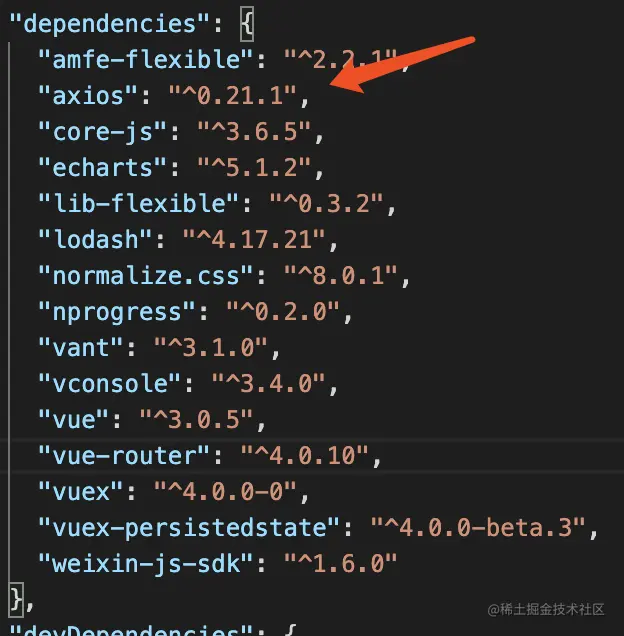
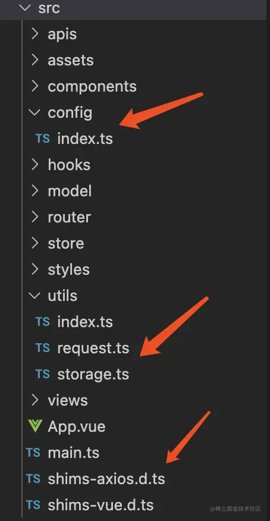

## 封装request和config请求信息抽离处理


1. 先安装axios，毕竟请求是基于axios的。

`npm`: npm install axios

`yarn`: yarn add axios




2. 在src的同级目录下，创建shims-axios.d.ts。用于做axios的ts声明





```
import { AxiosInstance, AxiosRequestConfig, AxiosPromise } from "axios"

declare module "axios" {
  export interface AxiosRequestConfig {
    /**
     * @description 设置为true，则会在请求过程中显示loading动画，直到请求结束才消失
     */
    loading?: boolean
    isDialog?: boolean
  }
  export interface AxiosInstance {
    <T = any>(config: AxiosRequestConfig): Promise<T>
    request<T = any>(config: AxiosRequestConfig): Promise<T>
    get<T = any>(url: string, config?: AxiosRequestConfig): Promise<T>
    delete<T = any>(url: string, config?: AxiosRequestConfig): Promise<T>
    head<T = any>(url: string, config?: AxiosRequestConfig): Promise<T>
    post<T = any>(
      url: string,
      data?: any,
      config?: AxiosRequestConfig
    ): Promise<T>
    put<T = any>(
      url: string,
      data?: any,
      config?: AxiosRequestConfig
    ): Promise<T>
    patch<T = any>(
      url: string,
      data?: any,
      config?: AxiosRequestConfig
    ): Promise<T>
  }
}
```


3. 在`src文件夹`下，创建`utils文件夹`，放封装文件`request.js`

   ``

   ```
   /**
    * @description [ axios 请求封装]
    */
   // import store from "@/store";
   import axios, { AxiosResponse, AxiosRequestConfig } from "axios";
   // import { Message, Modal } from 'view-design' // UI组件库
   import { Dialog, Toast } from "vant";
   import router from "@/router";
   // 根据环境不同引入不同api地址
   import { config } from "@/config";
   const service = axios.create({
     baseURL: config.baseApi + "/api", // url = base url + request url
     timeout: 5000,
     withCredentials: false // send cookies when cross-domain requests
     // headers: {
     //    // clear cors
     //    'Cache-Control': 'no-cache',
     //    Pragma: 'no-cache'
     // }
   })
   // Request interceptors
   service.interceptors.request.use(
     (config: AxiosRequestConfig) => {
       // 加载动画
       if (config.loading) {
         Toast.loading({
           message: "加载中...",
           forbidClick: true
         });
       }
       // 在此处添加请求头等，如添加 token
       // if (store.state.token) {
       // config.headers['Authorization'] = `Bearer ${store.state.token}`
       // }
       return config;
     },
     (error: any) => {
       Promise.reject(error);
     }
   )
   // Response interceptors
   service.interceptors.response.use(
     async (response: AxiosResponse) => {
       // await new Promise(resovle => setTimeout(resovle, 3000))
       Toast.clear();
       const res = response.data;
       if (res.code !== 0) {
         // token 过期
         if (res.code === 401)
           // 警告提示窗
           return;
         if (res.code == 403) {
           Dialog.alert({
             title: "警告",
             message: res.msg
           }).then(() => {})
           return
         }
         // 若后台返回错误值，此处返回对应错误对象，下面 error 就会接收
         return Promise.reject(new Error(res.msg || "Error"))
       }
       // 注意返回值
       else return response.data
     },
     (error: any) => {
       Toast.clear();
       if (error && error.response) {
         switch (error.response.status) {
           case 400:
             error.message = "请求错误(400)"
             break
           case 401:
             error.message = "未授权,请登录(401)"
             break
           case 403:
             error.message = "拒绝访问(403)"
             break
           case 404:
             error.message = `请求地址出错: ${error.response.config.url}`
             break
           case 405:
             error.message = "请求方法未允许(405)"
             break
           case 408:
             error.message = "请求超时(408)"
             break
           case 500:
             error.message = "服务器内部错误(500)"
             break
           case 501:
             error.message = "服务未实现(501)"
             break
           case 502:
             error.message = "网络错误(502)"
             break
           case 503:
             error.message = "服务不可用(503)"
             break
           case 504:
             error.message = "网络超时(504)"
             break
           case 505:
             error.message = "HTTP版本不受支持(505)"
             break
           default:
             error.message = `连接错误: ${error.message}`
         }
       } else {
         if (error.message == "Network Error") error.message == "网络异常，请检查后重试！"
         error.message = "连接到服务器失败，请联系管理员"
       }
       Toast(error.message)
       return Promise.reject(error)
     }
   )
   export default service
   ```

   

   1. 在`src文件夹`下面，创建`config文件夹`，放`index.ts`

   ``

   ```
   export interface IConfig {
       env: string // 开发环境
       mock?: boolean // mock数据
       title: string // 项目title
       baseUrl?: string // 项目地址
       baseApi?: string // api请求地址
       APPID?: string // 公众号appId  一般放在服务器端
       APPSECRET?: string // 公众号appScript 一般放在服务器端
   }
   
   const dev: IConfig = {
       env: "development",
       mock: false,
       title: "开发",
       baseUrl: "http://localhost:8001", // 项目地址
       baseApi: "https://baidu.com/api", // 本地api请求地址,注意：如果你使用了代理，请设置成'/'
       APPID: "wx123456778890",
       APPSECRET: "xxx"
   }
   
   const prod: IConfig = {
       env: "production",
       mock: false,
       title: "生产",
       baseUrl: "https://www.xxx.com/", // 正式项目地址
       baseApi: "https://www.baidu.com/api", // 正式api请求地址
       APPID: "wx1234567890",
       APPSECRET: "xxx"
   }
   
   export const config: IConfig = import.meta.env.MODE == 'development' ? dev : prod
   ```

   

   1. 配置`.env.development`和`.env.production`文件

   在根目录下，创建`.env.development`和`.env.production`文件

   ### .env.development

   

   ```
   NODE_ENV='development'
   # must start with VUE_APP_ 
   
   VUE_APP_ENV = 'development'
   
   OUTPUT_DIR = 'test'
   ```

   

   ### .env.production

   

   ```
   NODE_ENV='production'
   # must start with VUE_APP_
   
   VUE_APP_ENV = 'production'
   
   OUTPUT_DIR = 'dist'
   ```

   

   1. 配置`package.json`文件

   在scripts里面，修改成...

   根据不一样的命令，走不同的config接口

   

   ```
   "scripts": {
       "dev": "vite",
       "build": "vue-tsc --noEmit && vite build",
       "prod": "cross-env NODE_ENV=dev vue-cli-service serve --mode production",
       "lint": "vue-cli-service lint --mode development"
     }
   ```

   

   > 至此 request的封装和config请求信息抽离已经完成
   >
   > dev环境和prod环境也已经处理完成

   ## 封装storage文件

   在`utils`里面创建`storage.ts文件`, 放置storage文件

   

   ```
   /**
    * 封装操作localstorage本地存储的方法
    */
   export const storage = {
     //存储
     set(key: string, value: any) {
       localStorage.setItem(key, JSON.stringify(value))
     },
     //取出数据
     get<T>(key: string) {
       const value = localStorage.getItem(key)
       if (value && value != "undefined" && value != "null") {
         return <T>JSON.parse(value)
       }
     },
     // 删除数据
     remove(key: string) {
       localStorage.removeItem(key)
     }
   };
   /**
    * 封装操作sessionStorage本地存储的方法
    */
   export const sessionStorage = {
     //存储
     set(key: string, value: any) {
       window.sessionStorage.setItem(key, JSON.stringify(value))
     },
     //取出数据
     get<T>(key: string) {
       const value = window.sessionStorage.getItem(key)
       if (value && value != "undefined" && value != "null") {
         return JSON.parse(value)
       }
       return null
     },
     // 删除数据
     remove(key: string) {
       window.sessionStorage.removeItem(key)
     }
   }
   ```
